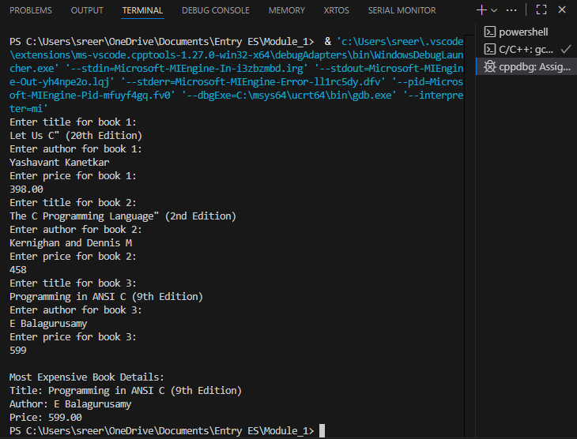

``Create a C program that defines a structure named Book with the following members:``
	•	title (string of up to 50 characters)
	•	author (string of up to 30 characters)
	•	price (float)
Write a program to:
Read details for 3 books from the user.
Print the details of the most expensive book.*/